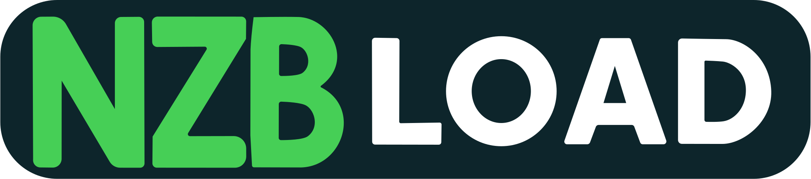
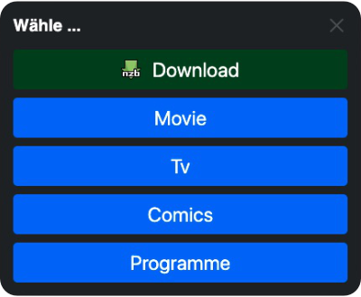

Modernes UserScript für das nahtlose Herunterladen von NZB-Dateien direkt über [nzblnk](https://nzblnk.info/). Links.
Es ist vollständig kompatibel mit SABnzbd und allen gängigen UserScript-Managern.

 
    
Nzb-Load  ist installiert
 
    

         <a href="#" class="open-nzbload-settings">Einstellungen öffnen</a> 
    
 

## 🚀 Schnellstart

1. 📦 [Installiere einen UserScript-Manager](userscripts-manager.md) (Tampermonkey, Violentmonkey oder Userscripts)
2. ⬇️ [Installiere das Nzb-Load UserScript](install.md)
3. ⚙️ [Einstellungen](options.md)
4. 🎯 Klicke auf einen `nzblnk:` Link, um das Script zu verwenden

## ✨ Funktionen

- **🔗 Automatische Erkennung**: Erkennt automatisch Links mit dem Schema "nzblnk:" und aktiviert sich nahtlos im
  Hintergrund.
- **⬇️ Intelligenter Download**: Wandelt nzblnk: Links um und ermöglicht direkten Download von nzbindex.com und anderen
  Quellen.
- **🏷️ SABnzbd Integration**: Integration mit Kategorie-Auswahl und direktem Upload zu deinem SABnzbd-Server.
- **⚙️ Flexible Ausgabe**: Wähle zwischen Menü-Dialog, direktem Download oder automatischer SABnzbd-Weiterleitung.

## 🎛️ Benutzeroberfläche

Das elegante Menü bietet dir alle Optionen auf einen Blick: vom direkten Download bis hin zur SABnzbd-Integration mit
Kategorieauswahl.

## 📚 Dokumentation

- [🔧 Installation](install.md) – Schritt-für-Schritt Anleitung für alle UserScript-Manager
- [⚙️ Einstellungen](options.md) – Alle Konfigurationsoptionen und deren optimale Verwendung
- [🎯 Verwendung](usage.md) – Praktische Tipps für den täglichen Gebrauch des Scripts
- [🔍 Fehlerbehebung](troubleshooting.md) – Lösungen für häufige Probleme und deren Behebung
- [🛠️ UserScript-Manager](userscripts-manager.md) – Übersicht über kompatible Manager und deren Features

## 💬 Links

- [🐙 GitHub Repository](https://github.com/LordBex/nzb-load)
- [🐛 Problem melden](https://github.com/LordBex/nzb-load/issues)
- [📥 UserScript herunterladen](https://github.com/LordBex/nzb-load/raw/main/nzb-load.user.js)
