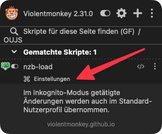
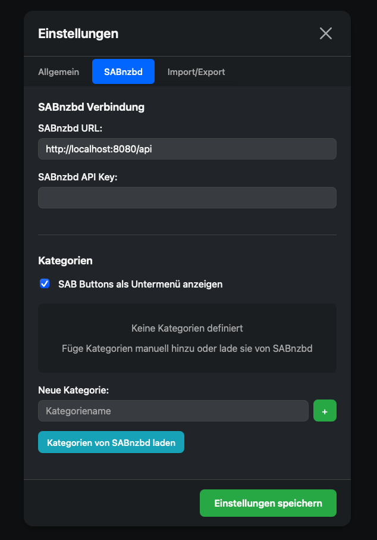

# Einstellungen für NZB-Load

Diese Seite erklärt die verschiedenen Einstellungsoptionen des NZB-Load UserScripts und wie du sie konfigurieren kannst.

 
    
Nzb-Load  ist installiert
 
    

         <a href="#" class="open-nzbload-settings">Einstellungen öffnen</a> 
    
 

## Zugriff auf die Einstellungen

### Über das Menü (Tampermonkey, Violentmonkey)

1. Klicke auf das Icon deines UserScript-Managers in der Browser-Toolbar
2. Wähle "NZB-Load" aus dem Menü
3. Klicke auf "Einstellungen"

### Über die Einstellungsseite (Userscripts App)

Da die Userscripts App für Safari den Menü-Button nicht unterstützt, musst du die Einstellungen über folgende URL öffnen:
[https://lordbex.github.io/nzb-load/settings.html](https://lordbex.github.io/nzb-load/settings.html)

 
    oder klicker hier:

    <a href="#" class="open-nzbload-settings">Einstellungen öffnen</a> 

## Verfügbare Einstellungen

### Allgemeine Einstellungen

| Einstellung                          | Beschreibung                                                                             | Standardwert |
|--------------------------------------|------------------------------------------------------------------------------------------|--------------|
| Ausgabe                              | Bestimmt, wie das Script reagiert, wenn ein nzblnk: Link geklickt wird                   | download     |
| Erfolgsbenachrichtigung deaktivieren | Wenn aktiviert, wird keine Benachrichtigung angezeigt, wenn ein Download erfolgreich war | false        |

#### Ausgabe-Optionen

- **menu**: Zeigt ein Menü mit Optionen an (Download oder an SABnzbd senden)
- **download**: Lädt die NZB-Datei direkt herunter, ohne ein Menü anzuzeigen
- **sabnzbd**: Sendet die NZB-Datei direkt an SABnzbd, ohne ein Menü anzuzeigen

### SABnzbd-Einstellungen

| Einstellung       | Beschreibung                                                           |
|-------------------|------------------------------------------------------------------------|
| API-Schlüssel     | Dein SABnzbd API-Schlüssel für die Authentifizierung                   |
| URL               | Die URL deiner SABnzbd-Installation                                    |
| Kategorien        | Liste der verfügbaren Kategorien in SABnzbd                            |
| Standardkategorie | Die Standardkategorie, die verwendet wird, wenn keine ausgewählt ist   |
| Untermenü         | Wenn aktiviert, werden SABnzbd-Kategorien in einem Untermenü angezeigt |

## SABnzbd einrichten

Um NZB-Load mit SABnzbd zu verwenden, musst du folgende Schritte ausführen:

1. Öffne deine SABnzbd-Weboberfläche
2. Gehe zu "Einstellungen" > "Allgemein"
3. Kopiere deinen **API-Schlüssel**
4. Füge den **API-Schlüssel** in die NZB-Load-Einstellungen ein
5. Gib die URL deiner SABnzbd-Installation ein (z.B. http://localhost:8080/api)
6. Speichere die Einstellungen

### Kategorien konfigurieren

Wenn du Kategorien in SABnzbd verwendest, kannst du diese in NZB-Load hinzufügen:

1. Gehe zu den NZB-Load-Einstellungen
2. Füge manuell die Kategorien hinzu oder beziehe sie automatisch von SABnzbd
3. Speichere die Einstellungen

## Einstellungen exportieren und importieren

In den Einstellungen kannst du deine Konfiguration exportieren und importieren.
Deine aktuelle Konfiguration wird als JSON-Datei gespeichert, die du später oder an anderen Geräten wieder importieren kannst.

