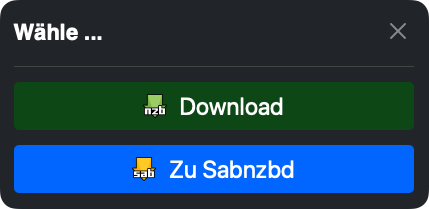

# Verwendung von NZB-Load

Diese Anleitung erklärt, wie du das NZB-Load UserScript im Alltag verwenden kannst.

## Was sind nzblnk: Links?

Das `nzblnk:`-URI-Schema definiert das Format von NZBLNKTM-Links zur Identifizierung binärer Usenet-Inhalte und 
enthält einige zusätzliche Informationen zu deren korrekter Handhabung.
```
nzblnk:?t=Beispiel&g=alt.binaries.example&p=passwort123
```

Diese Links enthalten Informationen wie:
- `t=` - Der Titel/Name
- `g=` - Die Newsgroup
- `p=` - Das Passwort (falls vorhanden)

[Weitere Informationen zu nzblnk: Links findest du auf der offiziellen Webseite](https://nzblnk.info/).

## Grundlegende Verwendung

1. Wenn du auf einen `nzblnk:` Link klickst, wird NZB-Load automatisch aktiviert
2. Je nach deinen [Einstellungen](options.md) passiert dann Folgendes:

### Menü-Modus (Standardeinstellung)

Wenn du die Ausgabe-Option auf "menu" eingestellt hast, erscheint ein Menü mit folgenden Optionen:



- **Download**: Lädt die NZB-Datei direkt auf deinen Computer herunter
- **Zu SABnzbd**: Öffnet ein Untermenü mit SABnzbd-Kategorien (wenn konfiguriert)

#### SABnzbd-Untermenü

Im SABnzbd-Untermenü kannst du:
- Eine Kategorie auswählen, in die die NZB-Datei hochgeladen werden soll
- "Zurück" wählen, um zum Hauptmenü zurückzukehren

### Direkter Download-Modus

Wenn du die Ausgabe-Option auf "download" eingestellt hast, wird die NZB-Datei automatisch heruntergeladen, ohne dass ein Menü angezeigt wird.

Die heruntergeladene Datei wird im Format `NAME{{PASSWORT}}.nzb` benannt, wobei:
- `NAME` der Titel aus dem nzblnk
- `{{PASSWORT}}` das Passwort aus dem nzblnk (falls vorhanden)

### SABnzbd-Modus

Wenn du die Ausgabe-Option auf "sabnzbd" eingestellt hast, wird die NZB-Datei automatisch an SABnzbd gesendet, ohne dass ein Menü angezeigt wird. Die Datei wird mit der in den Einstellungen festgelegten Standardkategorie hochgeladen.

## Beispielszenarien

### Szenario 1: Einfacher Download

1. Du findest einen nzblnk: Link auf einer Webseite
2. Du klickst auf den Link
3. Das NZB-Load Menü erscheint
4. Du wählst "Download"
5. Die NZB-Datei wird auf deinen Computer heruntergeladen

### Szenario 2: Upload zu SABnzbd mit Kategorie

1. Du findest einen nzblnk: Link auf einer Webseite
2. Du klickst auf den Link
3. Das NZB-Load Menü erscheint
4. Du wählst "Zu SABnzbd"
5. Du wählst eine Kategorie aus dem Untermenü
6. Die NZB-Datei wird an SABnzbd gesendet und in die ausgewählte Kategorie eingeordnet
